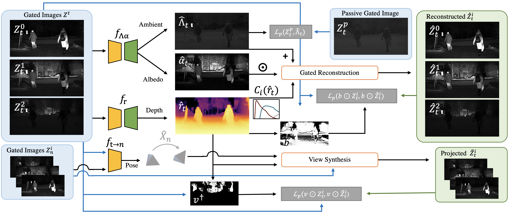
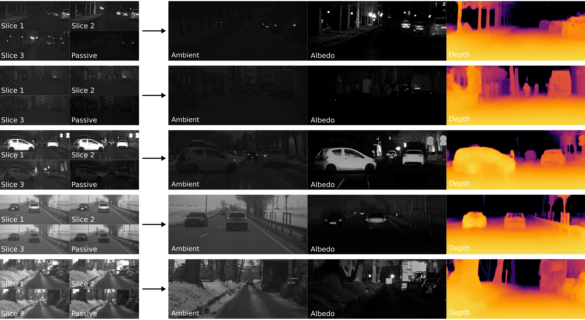
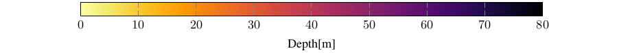

# Gated2Gated : Self-Supervised Depth Estimation from Gated Images



This repository contains code for [Gated2Gated : Self-Supervised Depth Estimation from Gated Images](https://arxiv.org/pdf/2112.02416.pdf). 
<!--Dataset will also be published soon.-->

## Summary
Gated cameras hold promise as an alternative to scanning LiDAR sensors with high-resolution 3D depth that is robust to back-scatter in fog, snow, and rain. Instead of sequentially scanning a scene and directly recording depth via the photon time-of-flight, as in pulsed LiDAR sensors, gated imagers encode depth in the relative intensity of a handful of gated slices, captured at megapixel resolution. Although existing methods have shown that it is possible to decode high-resolution depth from such measurements, these methods require synchronized and calibrated LiDAR to supervise the gated depth decoder -- prohibiting fast adoption across geographies, training on large unpaired datasets, and exploring alternative applications outside of automotive use cases. In this work, we fill this gap and propose an entirely self-supervised depth estimation method that uses gated intensity profiles and temporal consistency as a training signal. The proposed model is trained end-to-end from gated video sequences, does not require LiDAR or RGB data, and learns to estimate absolute depth values. We take gated slices as input and disentangle the estimation of the scene albedo, depth, and ambient light, which are then used to learn to reconstruct the input slices through a cyclic loss. We rely on temporal consistency between a given frame and neighboring gated slices to estimate depth in regions with shadows and reflections. We experimentally validate that the proposed approach outperforms existing supervised and self-supervised depth estimation methods based on monocular RGB and stereo images, as well as supervised methods based on gated images.

## Getting started
To get started, first clone this repository in your local directory using 

```
https://github.com/princeton-computational-imaging/Gated2Gated
```
For getting all the necessary packages, get the anaconda environment using:
```
conda env create -f environment.yml
```
Activate the environment using
```
conda activate gated2gated
```

Download the Gated2Gated dataset and the models from the [DENSE dataset webpage](https://www.uni-ulm.de/en/in/driveu/projects/dense-datasets).

Check if you have downloaded all files. Then, you can unzip your downloaded files using:
```
sh scripts/unzip_data.sh <dataset_download_folder> <dataset_destination_folder>
```

After unzipping the files, your directory should look like this:
```
gated2gated
├── data
│   ├── gated0_10bit
│   ├── gated0_10bit_history_1
│   ├── gated0_10bit_history_-1
│   ├── gated0_10bit_history_2
│   ├── gated0_10bit_history_-2
│   ├── gated0_10bit_history_3
│   ├── gated0_10bit_history_-3
│   ├── gated0_10bit_history_4
│   ├── gated0_10bit_history_-4
│   ├── gated0_10bit_history_-5
│   ├── gated0_10bit_history_-6
│   ├── gated0_8bit
│   ├── gated1_10bit
│   ├── gated1_10bit_history_1
│   ├── gated1_10bit_history_-1
│   ├── gated1_10bit_history_2
│   ├── gated1_10bit_history_-2
│   ├── gated1_10bit_history_3
│   ├── gated1_10bit_history_-3
│   ├── gated1_10bit_history_4
│   ├── gated1_10bit_history_-4
│   ├── gated1_10bit_history_-5
│   ├── gated1_10bit_history_-6
│   ├── gated1_8bit
│   ├── gated2_10bit
│   ├── gated2_10bit_history_1
│   ├── gated2_10bit_history_-1
│   ├── gated2_10bit_history_2
│   ├── gated2_10bit_history_-2
│   ├── gated2_10bit_history_3
│   ├── gated2_10bit_history_-3
│   ├── gated2_10bit_history_4
│   ├── gated2_10bit_history_-4
│   ├── gated2_10bit_history_-5
│   ├── gated2_10bit_history_-6
│   ├── gated2_8bit
│   ├── gated_passive_10bit
│   ├── gated_passive_10bit_history_1
│   ├── gated_passive_10bit_history_-1
│   ├── gated_passive_10bit_history_2
│   ├── gated_passive_10bit_history_-2
│   ├── gated_passive_10bit_history_3
│   ├── gated_passive_10bit_history_-3
│   ├── gated_passive_10bit_history_4
│   ├── gated_passive_10bit_history_-4
│   ├── gated_passive_10bit_history_-5
│   ├── gated_passive_10bit_history_-6
│   ├── gated_passive_8bit
│   ├── lidar_hdl64_strongest_filtered_gated
│   └── lidar_hdl64_strongest_gated
└── models
    ├── g2d
    ├── initialization
    └── stf
```

## Quick Example
Infer depth for single example using:
```
sh scripts/inference.sh
```
## Training
Train a model with pre-trained weights from lower resolution using:

```
sh scripts/train.sh
```

## Evaluation
If you have not trained the models by yourself, make sure that you have downloaded our models into the "models" folder.

Evaluation on [Seeing Trough Fog](https://openaccess.thecvf.com/content_CVPR_2020/papers/Bijelic_Seeing_Through_Fog_Without_Seeing_Fog_Deep_Multimodal_Sensor_Fusion_CVPR_2020_paper.pdf) Dataset:
```
sh scripts/eval_stf.sh
```
Please notice that we have used filtered LiDAR pointclouds for evaluating on the Seeing Through Fog dataset. These pointclouds are available in our Gated2Gated dataset.

Evaluation on [Gated2Depth](https://openaccess.thecvf.com/content_ICCV_2019/papers/Gruber_Gated2Depth_Real-Time_Dense_Lidar_From_Gated_Images_ICCV_2019_paper.pdf) Dataset:
```
sh scripts/eval_g2d.sh
```

<!-- ## Evaluation
For downloading the final weights, please refer to [here](weights/final/README.md).

**TBC** -->

<!-- ## Additional Material -->

### Pre-trained Models
Our final model weights for the [Seeing Through Fog](https://openaccess.thecvf.com/content_CVPR_2020/papers/Bijelic_Seeing_Through_Fog_Without_Seeing_Fog_Deep_Multimodal_Sensor_Fusion_CVPR_2020_paper.pdf) and the [Gated2Depth](https://openaccess.thecvf.com/content_ICCV_2019/papers/Gruber_Gated2Depth_Real-Time_Dense_Lidar_From_Gated_Images_ICCV_2019_paper.pdf) dataset are available for download at the [DENSE dataset webpage](https://www.uni-ulm.de/en/in/driveu/projects/dense-datasets).

## Examples



#### Day


#### Night


#### Fog


#### Snow


## Reference
If you find our work on gated depth estimation useful in your research, please consider citing our paper:

```bib
    @inproceedings{walia2022gated2gated,
      title={Gated2Gated: Self-Supervised Depth Estimation from Gated Images},
      author={Walia, Amanpreet and Walz, Stefanie and Bijelic, Mario and Mannan, Fahim and Julca-Aguilar, Frank and Langer, Michael and Ritter, Werner and Heide, Felix},
      booktitle={Proceedings of the IEEE/CVF Conference on Computer Vision and Pattern Recognition},
      pages={2811--2821},
      year={2022}
    }
}
```

## Acknowledgements

This code in parts is inspired/borrowed from [monodepth2](https://github.com/nianticlabs/monodepth2) and [packnet-sfm](https://github.com/TRI-ML/packnet-sfm).

